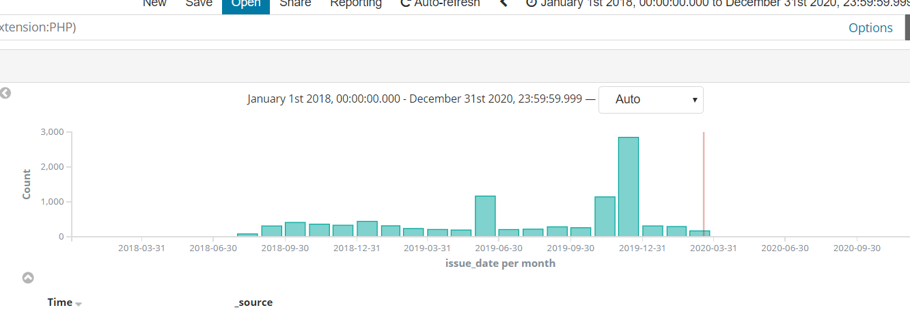
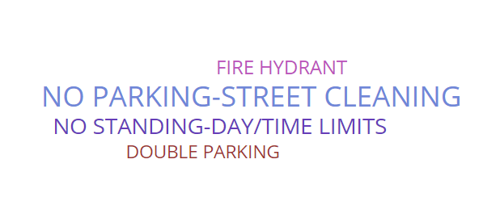
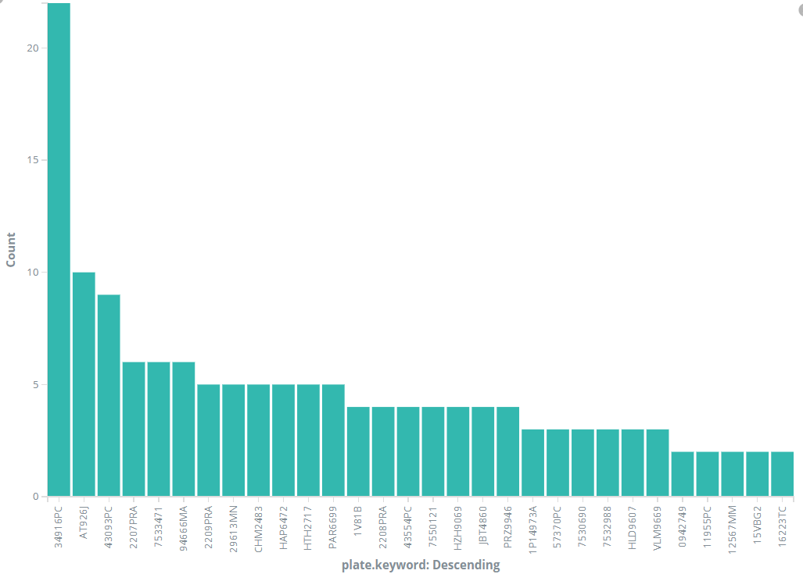
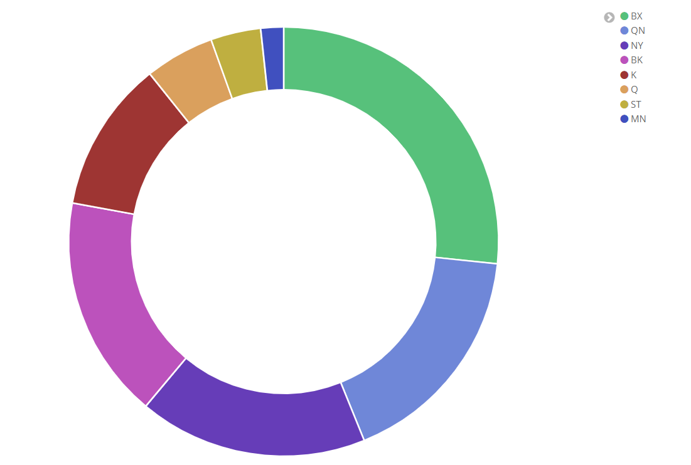

## Basic Analysis
Loaded 10000 violations into ElasticSearch, so analysis is done on this total set.

# Number of violations on time line.

# Most violation reason is "No parking - Street Cleaning": people tend to forget to move his/her cars.

# The top 30 plate numbers that have with multiple violations 

# The distribution on different counties 

